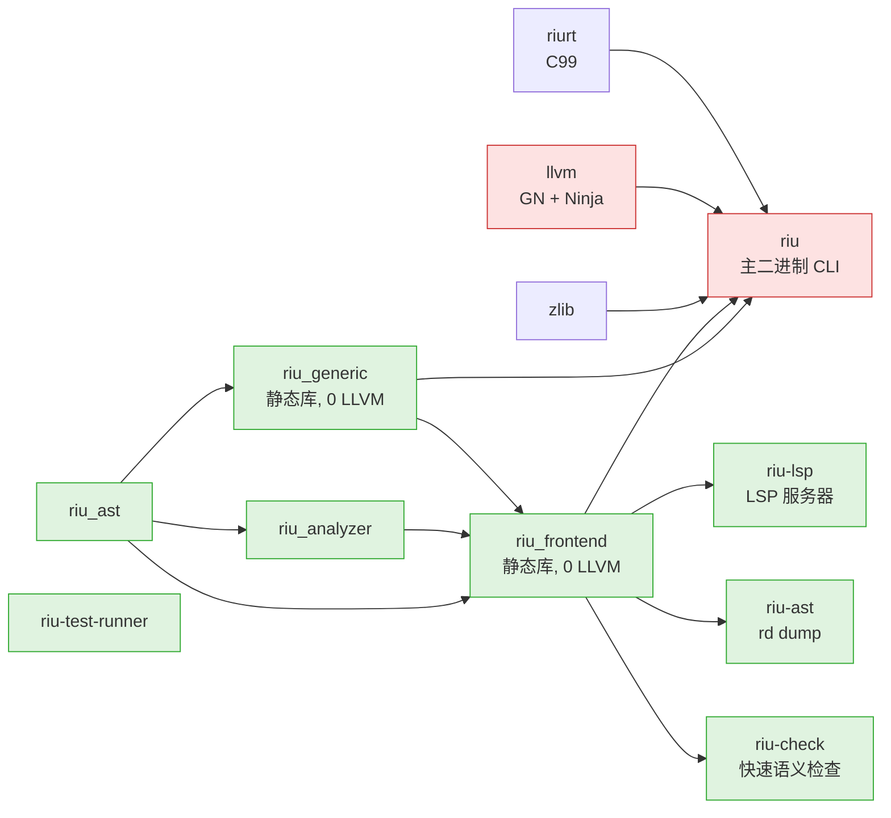
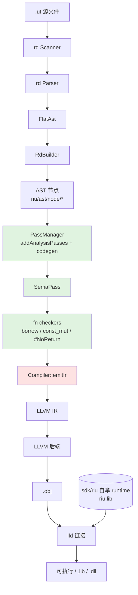
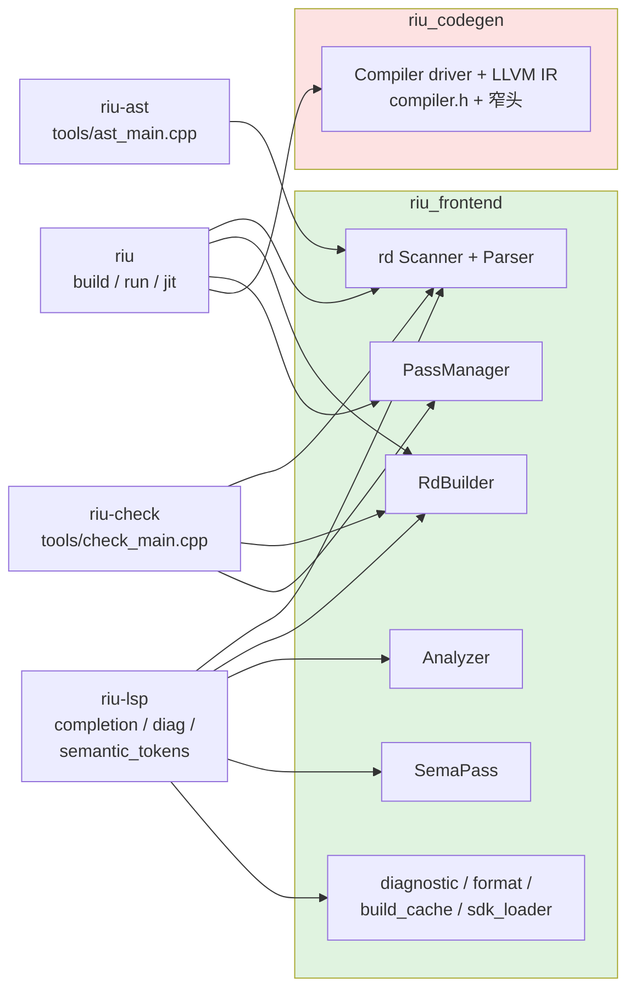
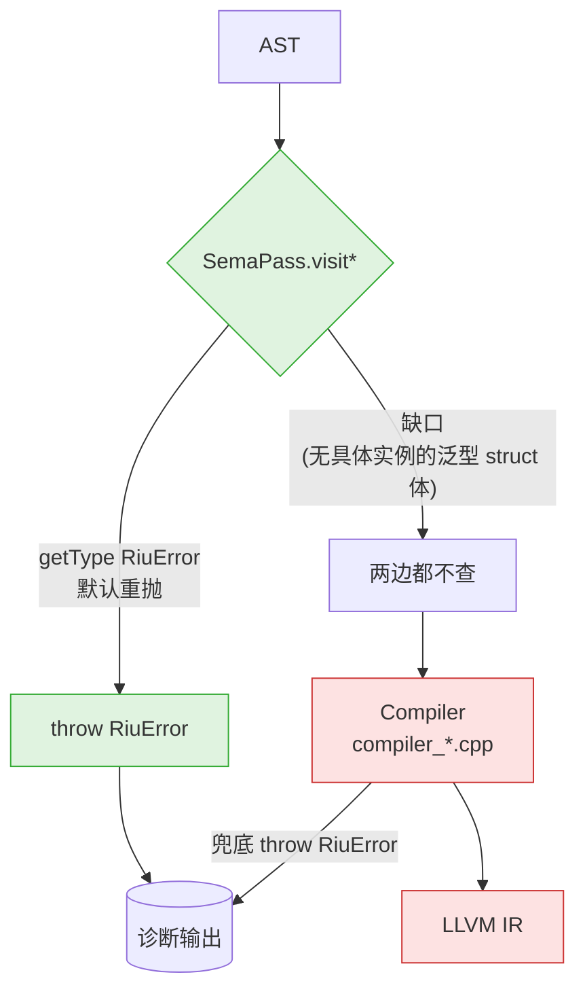
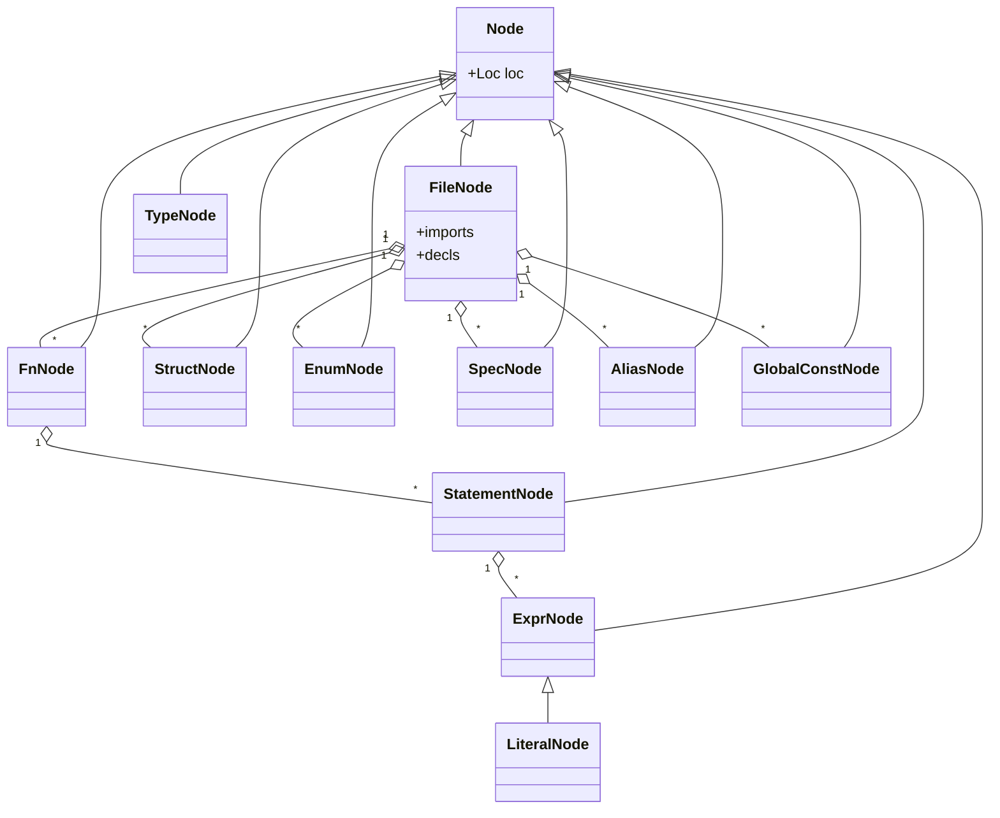
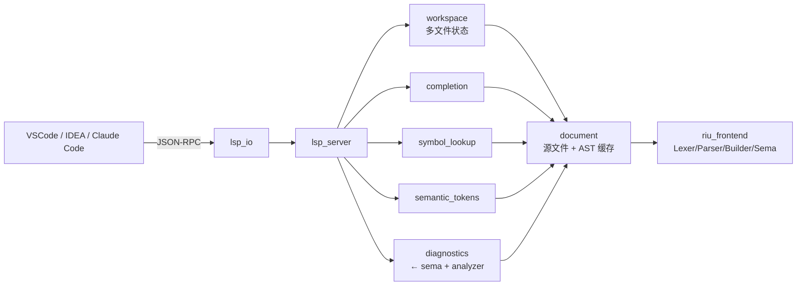

# riu-lang 架构图

本文件汇总 riu-lang 仓库的关键架构图，便于快速上手与跨模块讨论。图示用 Mermaid，配合 [RULES.md](RULES.md) / [rules/sema-codegen.md](rules/sema-codegen.md) 阅读。

权威源：`riu/ast/riu.bnf`（语法）+ `riu/ast/rd/`（词法/语法实现）+ `riu/` C++ 源码、`BUILD.gn` / `build/`（构建拓扑）。图与代码冲突时以代码为准，**回头更新本文档**而非反过来。

---

## 1. 构建 target 依赖（GN）



绿色 = 0 LLVM 依赖（编译快、可独立分发）；红色 = 链接整个 LLVM/lld。

GN 箭头是「被谁链接」。include 方向相反：`riu_ast` 不得 `#include "sema/..."` / `"analyzer/..."`，也不得在 `BUILD.gn` 加 `include_dirs = [ "//riu/frontend" ]`。

```
AST（数据 + 注解槽）  ←  Generic（替换栈 + struct / fn 实例表）  ←  Sema / Analyzer
                              ↑
                          Codegen（LLVM）
```

名字查找：`riu/ast/name_lookup.h`（已加载模块图，0 LLVM）。类型计算由 Sema 写槽；codegen 读槽，泛型 subst 帧用 `structuralType()` 回退。`riu_generic` 0 LLVM；`applySubst` / 替换栈 / struct·fn 实例表在 generic。codegen 问 Registry 要已具体实例再发 IR。

---

## 2. 编译管线（`riu build` 主路径）



注意 `SemaPass` 与 `Compiler` 的 throw 关系——见 [§4](#4-sema--codegen-双段分离)。parse / AST build **不**进 `PassManager`；新分析 = 新 `.cpp` + `addAnalysisPasses` 一行 `addPass`。

---

## 3. 各端入口对管线的复用



`riu-check` 与 `riu-lsp` 都建立在 frontend 之上，**保证语义检查不需要 LLVM**。

---

## 4. Sema / Codegen 双段分离

长期目标：`riu-check` 与 `riu build` 错误集等价。当前是半完成态，新代码必须遵守 [rules/sema-codegen.md](rules/sema-codegen.md)。



规则要点（写新 C++ 时必看）：

- `riu/ast/` 禁止 `#include "sema/..."` / `"analyzer/..."` / `"tools/..."`（frontend 路径）。
- `riu/frontend/sema/` 禁止 `#include "llvm/..."`，禁止访问 `IRBuilder` / `_module`。
- 让 sema 接管某错误码 → **默认即由 SemaPass 重抛**。若必须暂留 Compiler（假阳性），加入 `kDeferredCodes`，禁止静默吞。
- 新增 AST / 表达式类 → `AstVisitor` 加 `visitX = 0`，`SemaPass` / `Compiler` / formatter override；漏 override 编不过，不再静默 skip。
- sema 接管后 Compiler 端原 inline throw / validate 调用直接删除（v0.16 收尾）。

---

## 5. AST 节点家族



定义在 `riu/ast/node/*.h`。表达式 / 语句走 `AstVisitor` 双分派（`accept` + `visitX = 0`）；`SemaPass` / `Compiler` / formatter 经 override 分派。新增节点务必同步 `accept`、visitor 与 mangler/builder 路径。

---

## 6. LSP 子系统



入口 `riu/lsp/lsp_main.cpp`，编为 `riu-lsp`。

---

## 7. 仓库目录速览

详见 [RULES.md](RULES.md) 目录。一句话版：

- `riu/`：编译器实现（`riu/` 零 LLVM；`riu/riu/compiler/` 全 LLVM，`compiler.h` 是 driver，子系统在 `compiler_*.h`；`riu/analyzer/` 语义检查；`riu/lsp/` LSP；`riu/frontend/tools/` 工具）
- `sdk/riu/`：自举 runtime（独立 riu 项目 → `riu.lib`）
- `riu/ast/rd/`：手写 Scanner / Parser / FlatAst
- `docs/`：中文教程 + `docs/spec/` 规范草案
- `tests/`：单文件用例 + 项目用例（前缀分组）
- `plugins/`：编辑器 / Claude Code 插件
