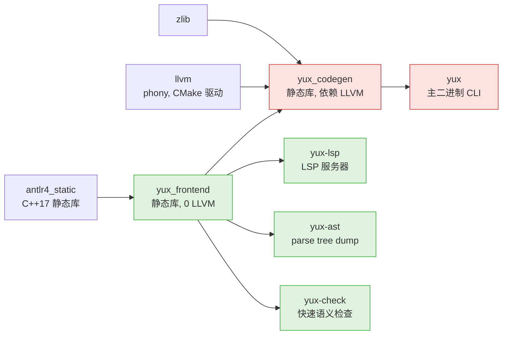
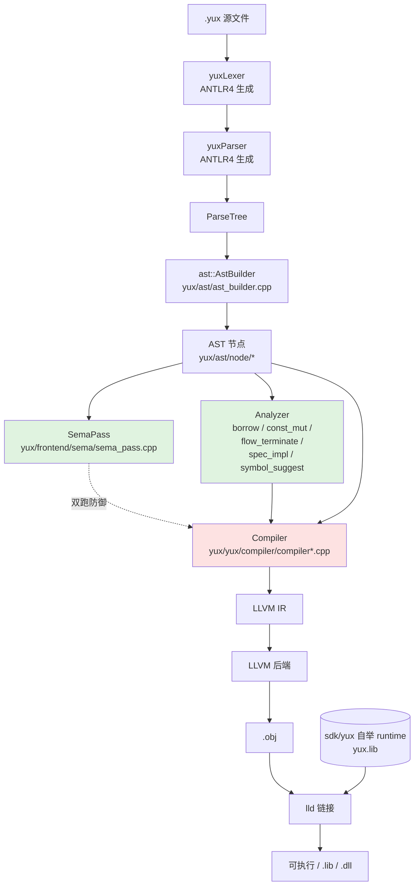
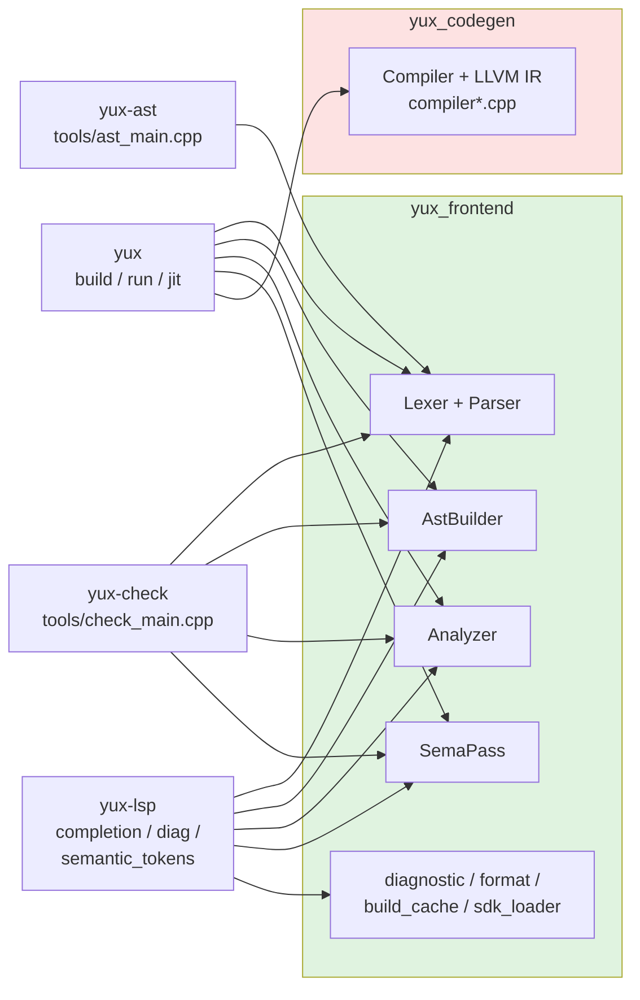
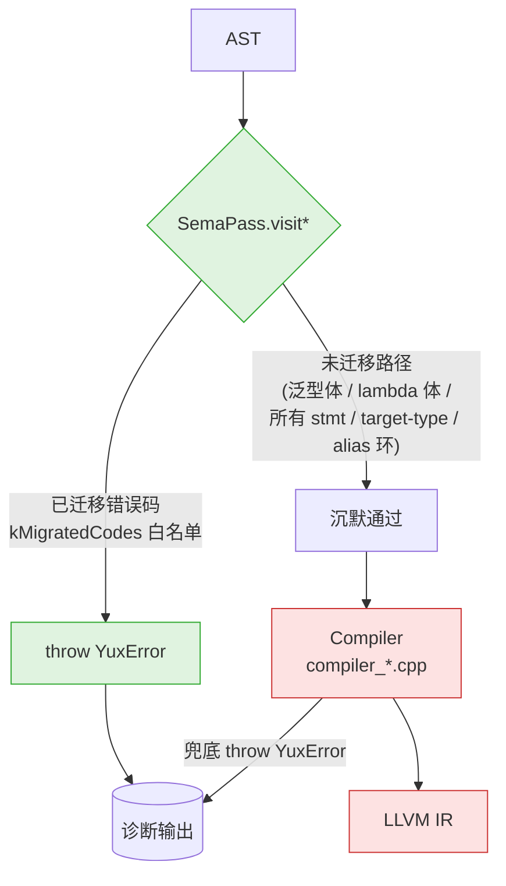
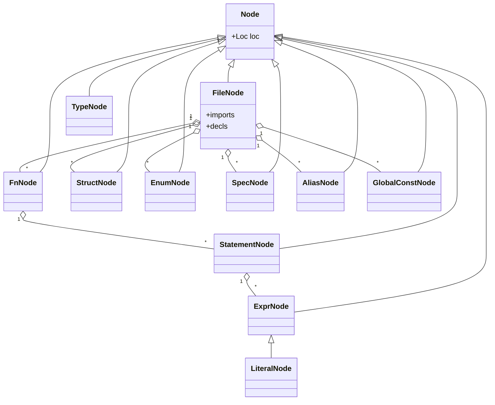
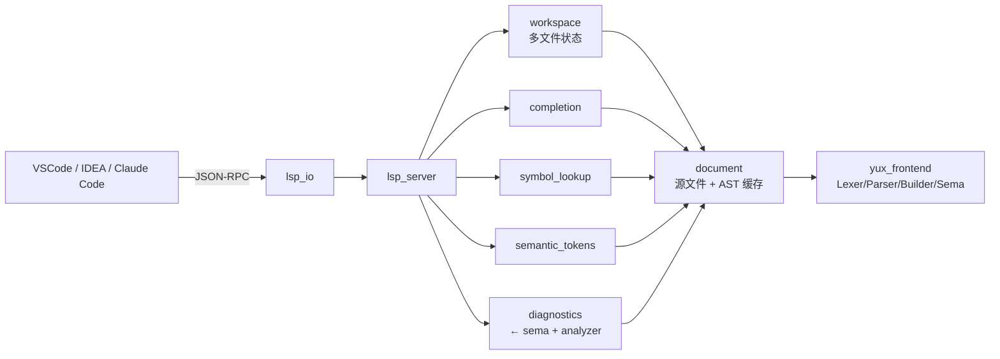

# yux-lang 架构图

本文件汇总 yux-lang 仓库的关键架构图，便于快速上手与跨模块讨论。图示用 Mermaid，配合 [RULES.md](RULES.md) / [rules/directory.md](rules/directory.md) / [rules/sema-codegen.md](rules/sema-codegen.md) 阅读。

权威源：`yux/ast/yux*.g4`（语法）、`yux/` C++ 源码、`xmake.lua`（构建拓扑）。图与代码冲突时以代码为准，**回头更新本文档**而非反过来。

---

## 1. 构建 target 依赖（xmake.lua）

绿色 = 0 LLVM 依赖（编译快、可独立分发）；红色 = 链接整个 LLVM/lld。

---

## 2. 编译管线（`yux build` 主路径）

注意 `SemaPass` 与 `Compiler` 的 throw 关系——见 [§4](#4-sema--codegen-双段分离)。

---

## 3. 各端入口对管线的复用

`yux-check` 与 `yux-lsp` 都建立在 frontend 之上，**保证语义检查不需要 LLVM**。

---

## 4. Sema / Codegen 双段分离

长期目标：`yux-check` 与 `yux build` 错误集等价。当前是半完成态，新代码必须遵守 [rules/sema-codegen.md](rules/sema-codegen.md)。

规则要点（写新 C++ 时必看）：

- `yux/frontend/sema/` 禁止 `#include "llvm/..."`，禁止访问 `IRBuilder` / `_module`。
- 让 sema 接管某错误码 → **必须同步更新 `kMigratedCodes` 白名单**，否则 sema 自身 try/catch 吞错、无测试能捕获。
- 新增 AST / 表达式类 → 在 `SemaPass::visitExpr` 加 dispatch 分支（即使是空占位），否则 sema 静默 skip 整个子树。
- sema 接管后 Compiler 端原 inline throw / validate 调用直接删除（v0.16 收尾）。

---

## 5. AST 节点家族

定义在 `yux/ast/node/*.h`；新增节点务必同步 `SemaPass::visitExpr` 与 mangler/builder 路径。

---

## 6. LSP 子系统

入口 `yux/lsp/lsp_main.cpp`，编为 `yux-lsp`。

---

## 7. 仓库目录速览

详见 [rules/directory.md](rules/directory.md)。一句话版：

- `yux/`：编译器实现（`yux/` 零 LLVM；`yux/yux/compiler/` 全 LLVM；`yux/analyzer/` 语义检查；`yux/lsp/` LSP；`yux/frontend/tools/` 工具）
- `sdk/yux/`：自举 runtime（独立 yux 项目 → `yux.lib`）
- `yux/ast/gen/`：ANTLR 生成代码（不要手改）
- `docs/`：中文教程 + `docs/spec/` 规范草案
- `tests/`：单文件用例 + 项目用例（前缀分组）
- `plugins/`：编辑器 / Claude Code 插件
